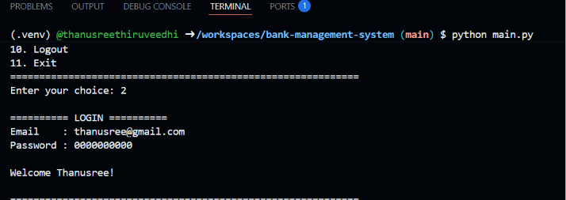
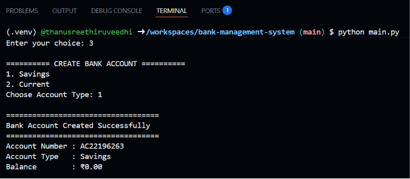
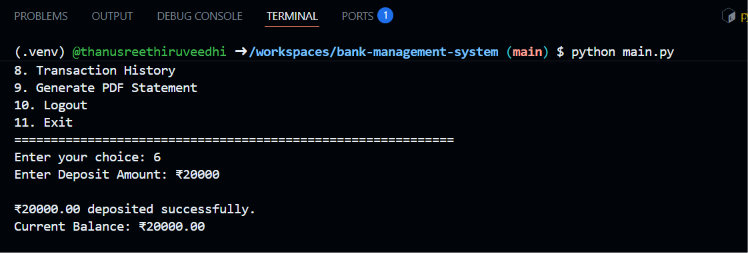
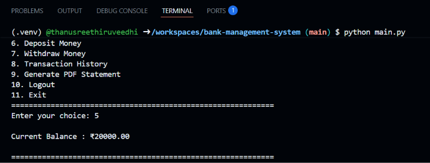
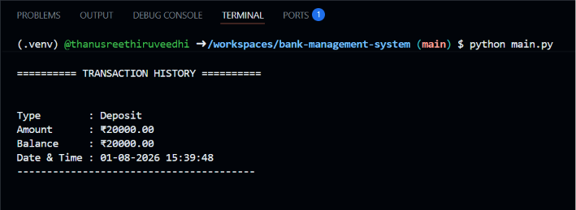

# 🏦 Bank Management System

A Bank Management System developed using **Python** and **SQLite** that allows users to create bank accounts, perform transactions, and generate PDF account statements.

---

## ✨ Features

- 👤 User Registration & Login
- 🔒 Secure Password Hashing (SHA-256)
- 🏦 Create Savings & Current Accounts
- 💰 Deposit Money
- 💸 Withdraw Money
- 💳 Check Account Balance
- 📜 Transaction History
- 📄 Generate PDF Bank Statement
- 🗄️ SQLite Database Integration
- 📂 Modular Python Project Structure

---

## 🛠️ Tech Stack

- Python 3
- SQLite3
- ReportLab
- Git
- GitHub

---

## 📂 Project Structure

```text
bank-management-system/
│
├── assets/
│
├── database/
│   └── (SQLite database created automatically)
│
├── reports/
│   └── (Generated PDF Statements)
│
├── src/
│   ├── account.py
│   ├── auth.py
│   ├── database.py
│   ├── statement.py
│   ├── transaction.py
│   ├── utils.py
│   └── __init__.py
│
├── .gitignore
├── LICENSE
├── main.py
├── README.md
└── requirements.txt
```

---

## 🚀 How to Run

### Clone the Repository

```bash
git clone https://github.com/thanusreethiruveedhi/bank-management-system.git
```

### Move into the Project Folder

```bash
cd bank-management-system
```

### Install Dependencies

```bash
pip install -r requirements.txt
```

### Run the Project

```bash
python main.py
```

---

## 📸 Screenshots

### Main Menu


### User Registration


### User Login


### Create Bank Account


### Deposit Money


### Check Balance


### Transaction History


### PDF Bank Statement


---

## 📜 License

This project is licensed under the MIT License.

---

## 👩‍💻 Author

**Thanusree Thiruveedhi**

GitHub: https://github.com/thanusreethiruveedhi
